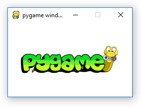
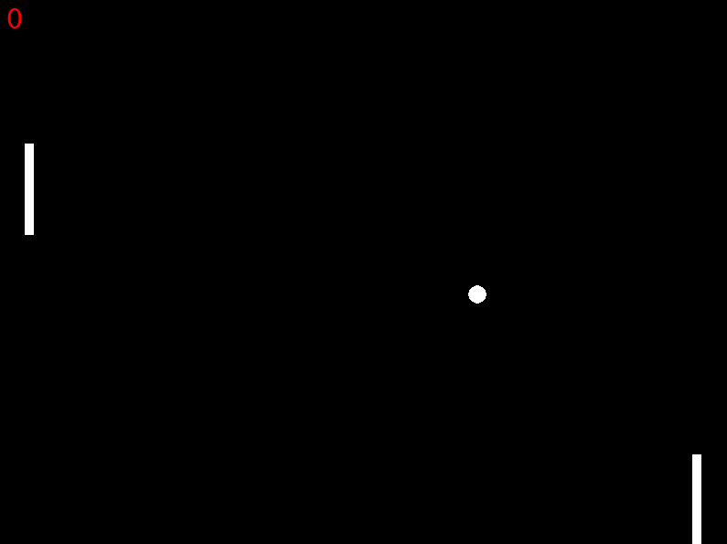
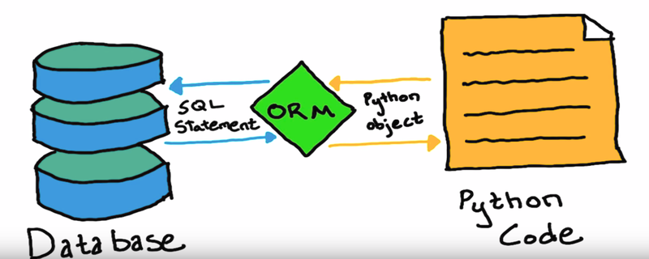

# Python -> nədir ?

<hr/>

### Python: 1991-ci ildə Hollandiyalı bir proqramçı Guido van Rossum tərəfindən yaradılmışdır. Veb proqramlarında, proqram təminatının hazırlanmasında, məlumat elmində,Kiber Təhlükəsizlik də belə geniş istifadə olunan obyekt-yönümlü proqramlaşdırma dilidir. Python proqramını yükləmək pulsuzdur, istənilən sistemlə yaxşı inteqrasiyanı təmin edir və inkişaf sürətini artırır.

```python

print(" Hellow World .!")

```

## PyGame -> nədir?

### PyGame Python dilinin kitabxanasıdır. O, 2-D oyunları inkişaf etdirmək üçün istifadə olunur və oyun hazırlamaq üçün bir sıra Python modullarından istifadə edə biləcəyiniz platformadır . Bu, asan başa düşülən və yeni başlayanlar üçün uyğun platformadır ki, sizə oyunları tez bir zamanda inkişaf etdirməyə kömək edə bilər.

<br/><br/>

<div style=" display:flex; justify-content: space-between;">


</div>
</div>
<br/><br/>

## Nədir bu Django, öyrənmə və avantajları ?

- ### Çətinlik və Layihəyə nəzarət:<br>

  > Djanqo mebelləri olan hazır ev kimidir. O, qutudan kənarda bir çox xüsusiyyətləri təmin edir, buna görə də tez başlaya bilərsiniz, ancaq evin strukturunu dəyişdirmək üçün daha az çevikliyiniz var.
  > Hazır modulları sayəsində sürətli inkişaf təmin edir.

- ### Layihənin strukturu:

  > Django xüsusi strukturu tətbiq edir. O, sizə addım-addım təlimat kitabçası kimi əşyaların hara qoyulacağının planını təqdim edir.<br/>
  > Hazır admin paneli vardır.

<div style=" width:95%; display:flex; height: 370px; gap: 10%; padding:40px  " >


</div>

- ### Öyrənmə:

  > Geniş xüsusiyyətləri və konvensiyalarına görə yeni başlayanlar üçün çətin olur,getdikcə öyrənə bilərsiniz.<br/> Bununla belə, mürəkkəb layihələrdə vaxta qənaət edə bilərsiniz.
  > Hazır istifadəçi modeli vardır.

- ### Ekosistem:

  > Django, demək olar ki, ehtiyacınız olan hər şeyi asanlıqla əldə edə biləcəyiniz böyük bir cəmiyyətə və geniş bir bazara malikdir.<br/>
  > Obyekt Əlaqəli Xəritəçəkmə (ORM) quruluşuna malikdir.

  <div style="width:100%; display:flex; justify-content: center;">
  
  </div>

- ### İstifadə halları:

  > Daha böyük layihələr, məzmun idarəçiliyi və daxili xüsusiyyətlərlə tez başlamaq istədiyiniz layihələr üçün ən yaxşısıdır.

- ### Sonuc😊:
  Django əvvəlcədən qurulmuş, yaxşı təchiz olunmuş avtomobil əldə etmək kimidir – siz yola daha tez çata bilərsiniz, lakin sonra onu dəyişdirmək daha çətin ola bilər. Seçiminiz nə qədər nəzarət istədiyinizdən və layihənizin ölçüsündən və mürəkkəbliyindən asılıdır.
